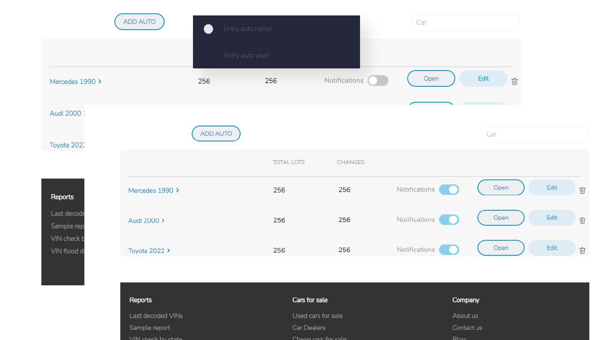

# Saved Searches

## Your users should be able to:

- Compose with adaptive
- Notifications - checkbox, when clicked, the image changes to the opposite
- Make a filter
- When clicking on the cart, delete a record from the table
- Implement post editing
- Implement adding new records

## Usage

`npm i`

`npm start` `npm run server`

### Coded by [EalsyCoD](https://github.com/EalsyCoD)